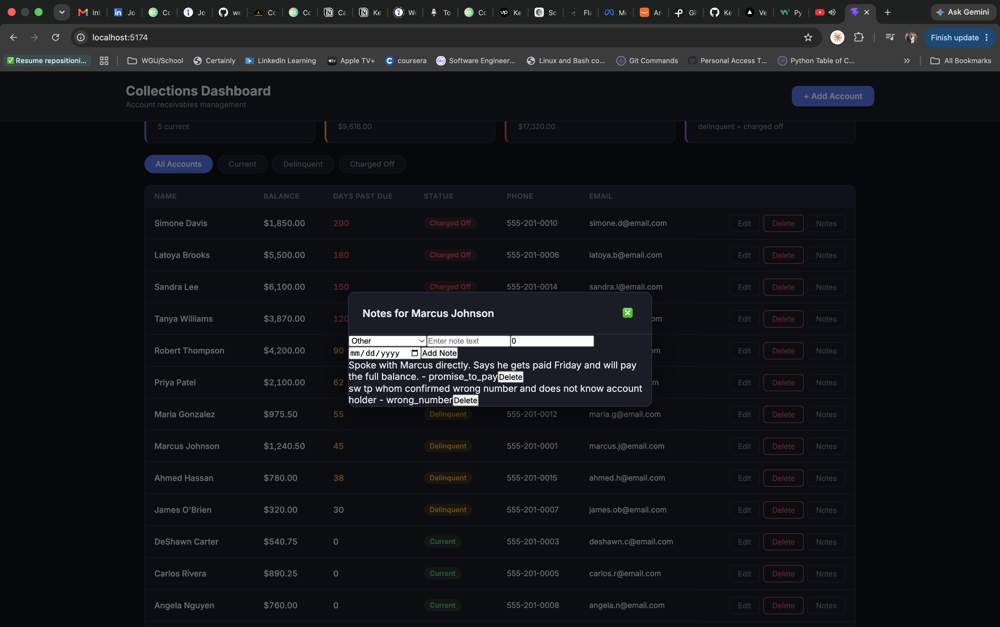
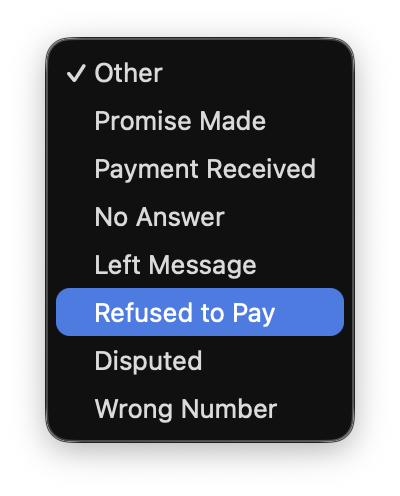

# Collections Dashboard

A full-stack account receivables management dashboard built with Flask and React.

## Screenshots





## Features

- View all accounts with balance, days past due, and status
- Filter accounts by status: Current, Delinquent, Charged Off
- Summary stats: total accounts, delinquent balance, charged-off balance, total exposure
- Add new accounts
- Edit existing accounts
- Delete accounts
- Contact / call log per account — log a call attempt with an outcome (No Answer, Left Message, Promise to Pay, Payment Made, Refused to Pay, Disputed, Wrong Number, Other), track promised payment amounts and dates, view the full history, and delete individual entries

## Tech Stack

| Layer      | Technology                               |
| ---------- | ---------------------------------------- |
| Frontend   | React + Vite                             |
| Backend    | Flask (Python)                           |
| ORM        | SQLAlchemy                               |
| Database   | SQLite (local) / PostgreSQL (production) |
| Deployment | Netlify (frontend) + Render (backend)    |

## Local Setup

### Backend

```bash
cd backend
python -m venv venv
source venv/bin/activate
pip install -r requirements.txt
python seed.py
python app.py
```

API runs at `http://localhost:5000`

### Frontend

```bash
cd frontend
npm install
npm run dev
```

App runs at `http://localhost:5173`

## API Endpoints

| Method | Endpoint              | Description                                    |
| ------ | --------------------- | ---------------------------------------------- |
| GET    | `/accounts`           | List all accounts (optional `?status=` filter) |
| GET    | `/accounts/stats`     | Summary statistics                             |
| POST   | `/accounts`           | Create a new account                           |
| PUT    | `/accounts/:id`       | Update an account                              |
| DELETE | `/accounts/:id`       | Delete an account                              |
| GET    | `/accounts/:id/notes` | List an account's contact/call log             |
| POST   | `/accounts/:id/notes` | Log a new contact attempt                      |
| DELETE | `/notes/:id`          | Delete a logged note                           |

## Deployment

- **Backend**: Deployed on [Render](https://render.com)
- **Frontend**: Deployed on [Netlify](https://netlify.com)

Update `const API` in `frontend/src/App.jsx` with your Render URL before deploying the frontend.
